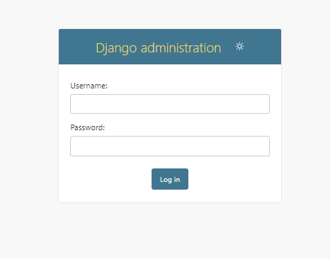
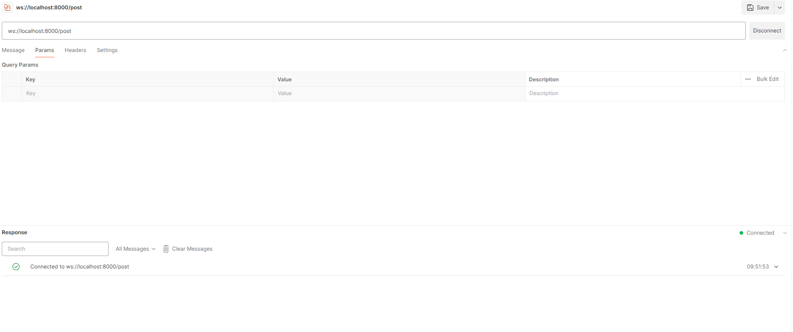
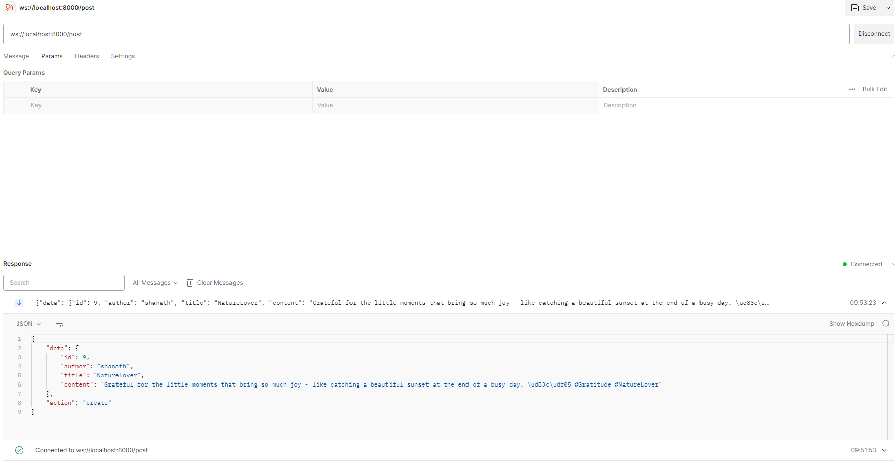
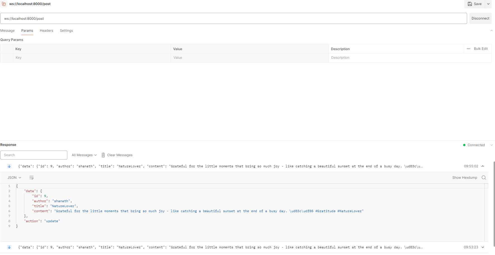
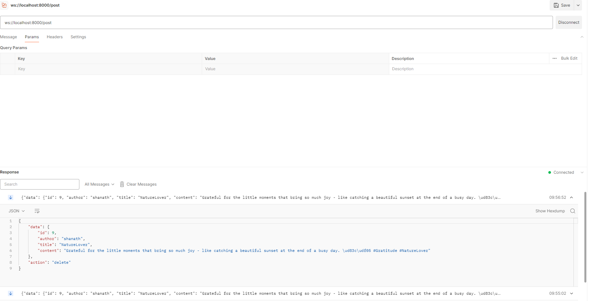

#  Blog Post APIs with Django Channels

#### This project entails the acquisition of real-time data through Django Channels, utilizing Redis and Django REST Framework for efficient implementation.
#### The utilization of the `djangochannelsrestframework` library was instrumental in shaping the project's framework. Leveraging its features, we seamlessly implemented a real-time, RESTful API infrastructure using Django Channels.
#### Redis is an essential component of our project, ensuring unparalleled efficiency and speed by enabling lightning-fast data retrieval, seamless message brokering and cache management.
## Setup

The first thing to do is to clone the repository:

```sh
git clone https://--------------------
cd test_djangoChannels
```

Create a virtual environment to install dependencies in and activate it:

```shell
# Creating virtual environment
python -m venv venv

# In cmd.exe
venv\Scripts\activate.bat
```

Then install the dependencies:

```shell
(venv)$ pip install -r requirements.txt
```

Note the `(venv)` in front of the prompt. This indicates that this terminal
session operates in a virtual environment set up by `venv`.

Once `pip` has finished downloading the dependencies. 

Default it will connect sqlite3 database.
For connecting Postgresql

#### * Open settings.py in test_oauth2 folder

Remove :

```shell
DATABASES = {
    'default': {
        'ENGINE': 'django.db.backends.sqlite3',
        'NAME': BASE_DIR / 'db.sqlite3',
    }
}
```
Add:
```shell
DATABASES = {
    'default': {
        'ENGINE': 'django_tenants.postgresql_backend',
        'NAME': '<Database Name>',
        'USER': '<postgres username>',
        'PASSWORD': '<postgres password>',
        'HOST': '<postgres host address>',
        'PORT': <postgres port>
    }
}

```
Provide or change the redis configuration:
```shell
CHANNEL_LAYERS = {
    "default": {
        "BACKEND": "channels_redis.core.RedisChannelLayer",
        "CONFIG": {
            "hosts": [(<Host>, <Port>)],
        },
    },
}
```

Run this commands in CMD:
```shell
(venv)$ python manage.py makemigrations
(venv)$ python manage.py migrate
(venv)$ python manage.py createsuperuser
Username (leave blank to use '---'): <Enter username>
Email address:<Enter email address>
Password: <Enter Password>
Password (again): <Enter Password Again>
(venv)$ python manage.py runserver
```

And navigate to http://127.0.0.1:8000.

Endpoints:
```shell
1. admin/
2. post
```

## 1. admin/

Admin Panel
http://127.0.0.1:8000/admin



* To Login into Admin Panel

## 2. post/

* This Endpoint provides the CRUD Operations using request methods GET, POST, PUT, DELETE

### I. GET Method

* This Method helps to get the list of posts

```shell
URL : http://127.0.0.1:8000/post
Request Method: GET
```
Example cURL Code:

```shell
curl --location 'http://127.0.0.1:8000/post'
```

### II.POST Method

* This Method helps to create the post

```shell
URL : http://127.0.0.1:8000/user_create/
Request Method: POST
payload:
  {
    "author": "<author name>",
    "title": "<Title>",
    "content": "<Content>"
 }
```

Example cURL Code:

```shell
curl --location 'http://127.0.0.1:8000/post' \
--header 'Content-Type: application/json' \
--data '{
    "author": "<author name>",
    "title": "<Title>",
    "content": "<Content>"
}'
```

### III. PUT Method

* This Method helps to update the post

* Here need to pass the data what are the fields to update 

```shell
URL : http://127.0.0.1:8000/post
Request Method: PUT
payload:
  {
    "id": <post id>,
    "author": "<author name>",
    "title": "<Title>",
    "content": "<Content>"
 }
```

Example cURL Code:

```shell
curl --location --request PUT 'http://127.0.0.1:8000/post' \
--header 'Content-Type: application/json' \
--data '{
    "id": <post id>,
    "author": "<author name>",
    "title": "<Title>",
    "content": "<Content>"
}'
```

### IV. DELETE Method

* This Method helps to deleting post

```shell
URL : http://127.0.0.1:8000/post
Request Method: DELETE
payload:
  {
    "id": <post id>
 }
```

Example cURL Code:

```shell
curl --location --request DELETE 'http://127.0.0.1:8000/post' \
--header 'Content-Type: application/json' \
--data '{
    "id": <post id>
}'
```

## Websocket



* Once new post is created



* Once post is Updated



* Once post is Deleted

